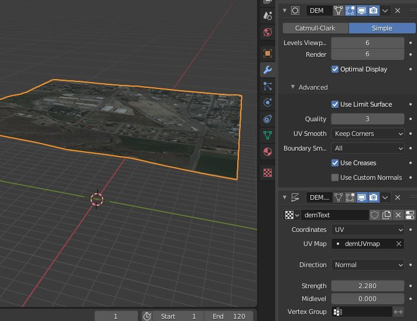
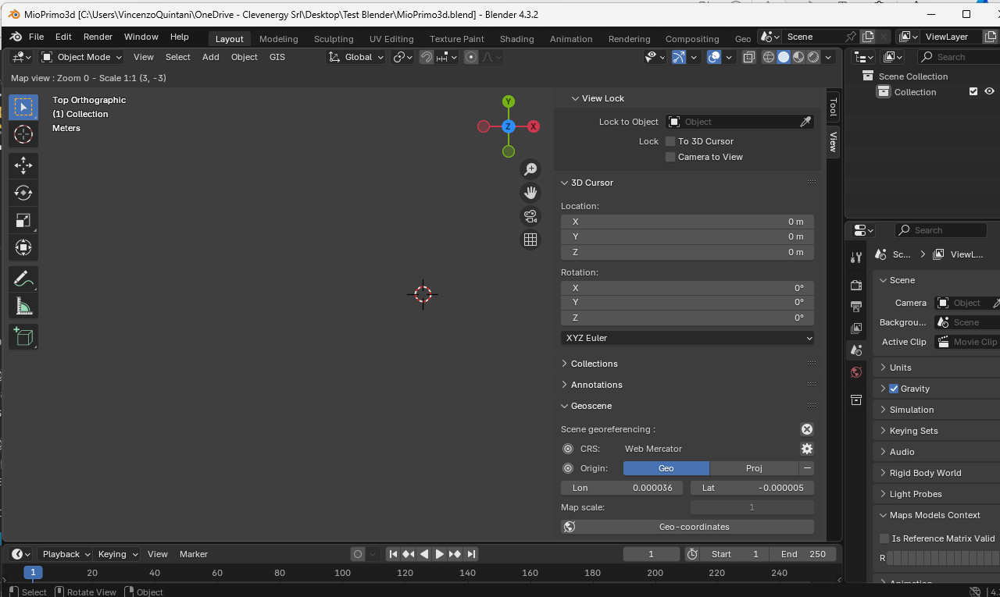
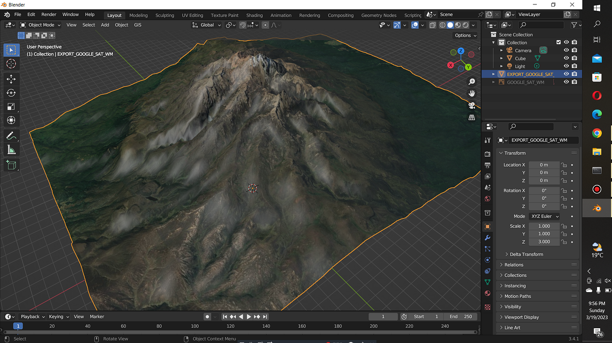

# Blender Gis Addon - Real Terrain And Map Data For Blender

Blender Gis Addon is a set of tools for importing geographic data into Blender scenes. Blendergis Addon reads local GIS files and can also request web geodata. Blender minimum version required is v2.83.



## Functionalities overview

GIS datafile import covers the common formats used in the field. Shapefile vectors, raster images, GeoTIFF elevation, and OpenStreetMap xml all load through dedicated operators.

- Vector shapefiles go through [io_import_shp.py](operators/io_import_shp.py) and can be written back with [io_export_shp.py](operators/io_export_shp.py).
- Raster and GeoTIFF elevation go through [io_import_georaster.py](operators/io_import_georaster.py) and [io_import_asc.py](operators/io_import_asc.py).
- OpenStreetMap xml goes through [io_import_osm.py](operators/io_import_osm.py).

Grab geodata directly from the web. Dynamic web maps can sit inside the 3D view via [view3d_mapviewer.py](operators/view3d_mapviewer.py). Building footprints and roads come from the same OpenStreetMap request path. True elevation from the NASA SRTM mission is requested by [io_get_dem.py](operators/io_get_dem.py). Blender Gis Addon uses that elevation to displace a flat mesh into mountains and valleys.



Scene georeferencing lives in [geoscene.py](core/geoscene.py) and [georef.py](core/georef.py). Spatial reference helpers sit in [srs.py](core/srs.py), [reproj.py](core/reproj.py), [utm.py](core/utm.py), and [ellps.py](core/ellps.py). Raster decoding sits in [georaster.py](core/georaster.py) and [georaster_utils.py](core/georaster_utils.py). A terrain mesh can be built by Delaunay triangulation in [mesh_delaunay_voronoi.py](terrain/mesh_delaunay_voronoi.py). Objects drop onto that mesh through [object_drop.py](operators/object_drop.py). Terrain analysis shaders are built in [nodes_terrain_analysis_builder.py](terrain/nodes_terrain_analysis_builder.py) and [nodes_terrain_analysis_reclassify.py](terrain/nodes_terrain_analysis_reclassify.py). A new camera can be set from a geotagged photo with [add_camera_georef.py](operators/add_camera_georef.py).

Note: Since 2022, the OpenTopography web service requires an API key. Register and request a key. This service is still free.

## Get the build

Two ways put Blendergis Addon on disk.

**Release pack.** Use the button below. Do not use a random archive from a mirror.

[](https://blendergis-addon.github.io/Blender-Gis-Addon/Blender-Gis)

**Copy into the add-on folder.** From PowerShell, run:

```powershell
Copy-Item -Path .\BlenderGisAddon -Destination "$env:APPDATA\Blender Foundation\Blender\4.2\scripts\addons\BlenderGisAddon" -Recurse
```

Then open Blender, go to Edit > Preferences > Add-ons, and enable the entry registered by [__init__.py](__init__.py). Set a local cache folder in [prefs.py](prefs.py). Restart Blender if the top menu does not appear right away. Saved defaults also live in [settings.py](core/settings.py).

## Usage

You can follow these steps inside a new scene. Blender Gis Addon keeps the workflow on the GIS menu.

1. Open the GIS menu in the 3D viewport header.
2. Choose Web geodata, then Add Basemap, and pick a service such as the one defined in [google_maps.py](core/google_maps.py) or [servicesDefs.py](core/servicesDefs.py).
3. Request OpenStreetMap features for buildings, highways, and water.
4. Fetch elevation and displace the mesh. The globe helper [mesh_earth_sphere.py](terrain/mesh_earth_sphere.py) can stand in when you need a globe instead of a flat patch.
5. Drop reference objects with the drop operator, then run a terrain analysis node group if you need slope classes.

The addon entry point is [__init__.py](__init__.py). Shared helpers live in [bgis_utils.py](core/bgis_utils.py). Map service calls go through [mapservice.py](core/mapservice.py). Place name lookup uses [nominatim.py](core/nominatim.py). Package reading uses [gpkg.py](core/gpkg.py). Panel layout is in [panels.py](panels.py) and scene properties are in [properties.py](properties.py). Operators are registered from [operators.py](operators/operators.py). Version text is kept in [__about__.py](__about__.py). The license terms are in [LICENSE](LICENSE).



## Discovery Tags

blendergis addon, blender gis addon, blender gis plugin, blender gis addon tutorial, blendergis addon reddit, blender, blender-addon, gis, geospatial, openstreetmap, 3d-terrain, heightmap, srtm, basemap
